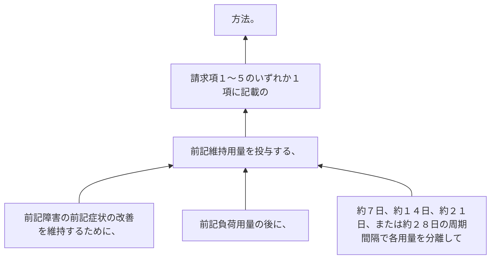

前記障害の前記症状の改善を維持するために、前記負荷用量の後に、約７日、約１４日、約２１日、または約２８日の周期間隔で各用量を分離して前記維持用量を投与する、請求項１～５のいずれか１項に記載の方法。

```mermaid
flowchart BT
F[方法。]
E[請求項１～５のいずれか１項に記載の]
D[前記維持用量を投与する、]
A[前記障害の前記症状の改善を維持するために、]
B[前記負荷用量の後に、]
C[約７日、約１４日、約２１日、または約２８日の周期間隔で各用量を分離して]

A --> D
B --> D
C --> D
D --> E
E --> F
```