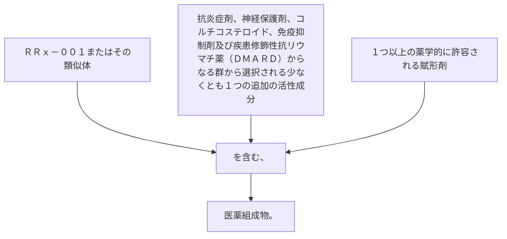

ＲＲｘ－００１またはその類似体、ならびに抗炎症剤、神経保護剤、コルチコステロイド、免疫抑制剤及び疾患修飾性抗リウマチ薬（ＤＭＡＲＤ）からなる群から選択される少なくとも１つの追加の活性成分、ならびに１つ以上の薬学的に許容される賦形剤を含む、医薬組成物。

```mermaid
flowchart TD
A[ＲＲｘ－００１またはその類似体]
B[抗炎症剤、神経保護剤、コルチコステロイド、免疫抑制剤及び疾患修飾性抗リウマチ薬（ＤＭＡＲＤ）からなる群から選択される少なくとも１つの追加の活性成分]
C[１つ以上の薬学的に許容される賦形剤]
D[を含む、]
E[医薬組成物。]
A --> D
B --> D
C --> D
D --> E
```