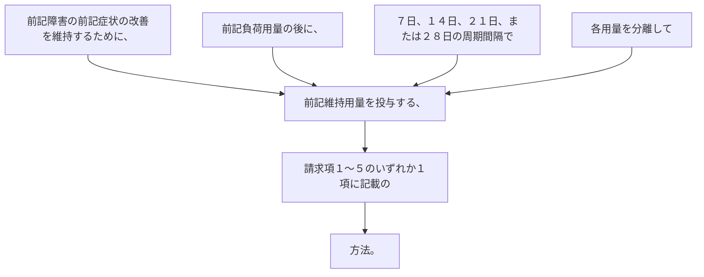

前記障害の前記症状の改善を維持するために、前記負荷用量の後に、７日、１４日、２１日、または２８日の周期間隔で各用量を分離して前記維持用量を投与する、請求項１～５のいずれか１項に記載の方法。

```mermaid
flowchart TD
A[前記障害の前記症状の改善を維持するために、]
B[前記負荷用量の後に、]
C[７日、１４日、２１日、または２８日の周期間隔で]
D[各用量を分離して]
E[前記維持用量を投与する、]
F[請求項１～５のいずれか１項に記載の]
G[方法。]
A --> E
B --> E
C --> E
D --> E
E --> F
F --> G
```