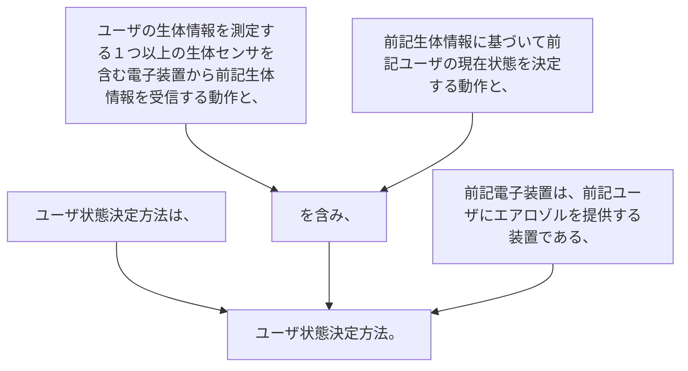

```mermaid
flowchart TD
A[ユーザ状態決定方法は、]
B[ユーザの生体情報を測定する１つ以上の生体センサを含む電子装置から前記生体情報を受信する動作と、]
C[前記生体情報に基づいて前記ユーザの現在状態を決定する動作と、]
D[を含み、]
E[前記電子装置は、前記ユーザにエアロゾルを提供する装置である、]
F[ユーザ状態決定方法。]
A --> F
B --> D
C --> D
D --> F
E --> F
```