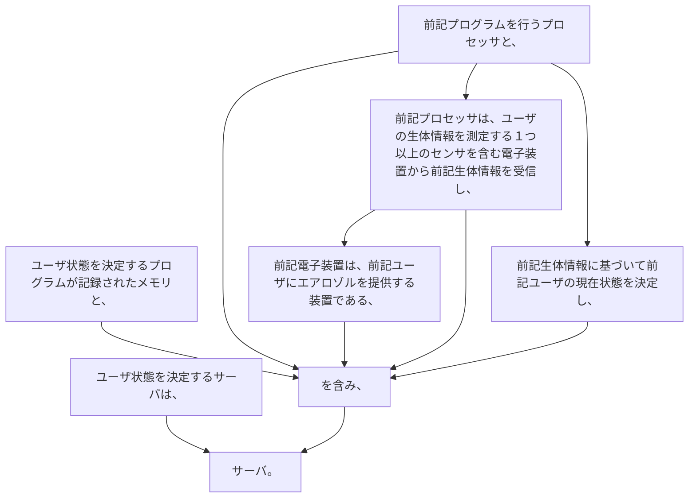

ユーザ状態を決定するサーバは、
ユーザ状態を決定するプログラムが記録されたメモリと、
前記プログラムを行うプロセッサと、
を含み、
前記プロセッサは、
ユーザの生体情報を測定する１つ以上のセンサを含む電子装置から前記生体情報を受信し、
前記生体情報に基づいて前記ユーザの現在状態を決定し、
前記電子装置は、前記ユーザにエアロゾルを提供する装置である、サーバ。

```mermaid
flowchart TD
A[ユーザ状態を決定するサーバは、]
B[ユーザ状態を決定するプログラムが記録されたメモリと、]
C[前記プログラムを行うプロセッサと、]
D[を含み、]
E[前記プロセッサは、ユーザの生体情報を測定する１つ以上のセンサを含む電子装置から前記生体情報を受信し、]
F[前記生体情報に基づいて前記ユーザの現在状態を決定し、]
G[前記電子装置は、前記ユーザにエアロゾルを提供する装置である、]
H[サーバ。]
A --> H
B --> D
C --> D
C --> E
C --> F
E --> G
E --> D
F --> D
G --> D
D --> H
```