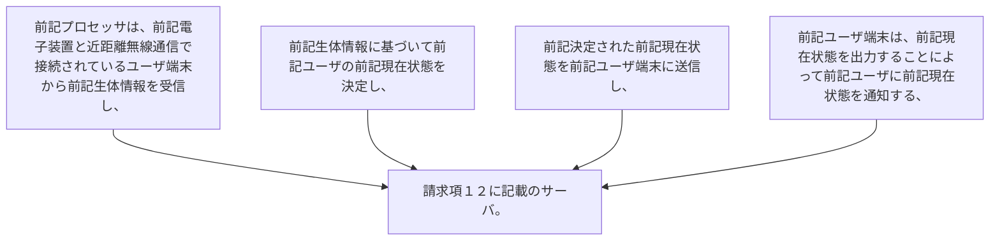

```mermaid
flowchart TD
A["前記プロセッサは、前記電子装置と近距離無線通信で接続されているユーザ端末から前記生体情報を受信し、"]
B["前記生体情報に基づいて前記ユーザの前記現在状態を決定し、"]
C["前記決定された前記現在状態を前記ユーザ端末に送信し、"]
D["前記ユーザ端末は、前記現在状態を出力することによって前記ユーザに前記現在状態を通知する、"]
E["請求項１２に記載のサーバ。"]
A --> E
B --> E
C --> E
D --> E
```