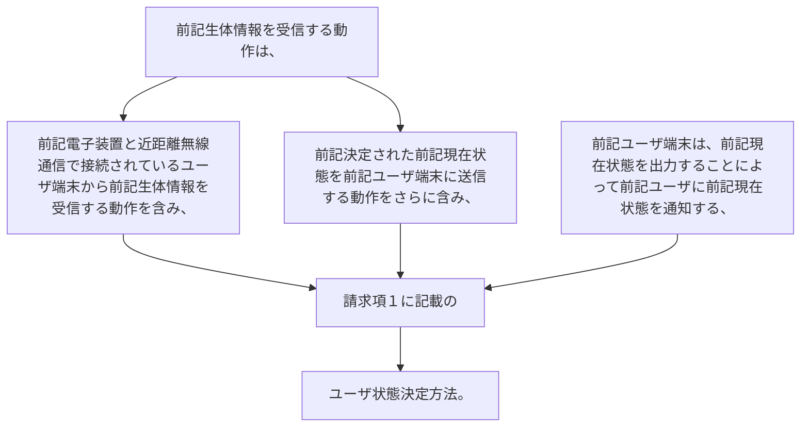

前記生体情報を受信する動作は、
前記電子装置と近距離無線通信で接続されているユーザ端末から前記生体情報を受信する動作を含み、
前記決定された前記現在状態を前記ユーザ端末に送信する動作をさらに含み、
前記ユーザ端末は、前記現在状態を出力することによって前記ユーザに前記現在状態を通知する、請求項１に記載のユーザ状態決定方法。

```mermaid
flowchart TD
A[前記生体情報を受信する動作は、]
B[前記電子装置と近距離無線通信で接続されているユーザ端末から前記生体情報を受信する動作を含み、]
C[前記決定された前記現在状態を前記ユーザ端末に送信する動作をさらに含み、]
D[前記ユーザ端末は、前記現在状態を出力することによって前記ユーザに前記現在状態を通知する、]
E[請求項１に記載の]
F[ユーザ状態決定方法。]
A --> B
A --> C
B --> E
C --> E
D --> E
E --> F
```