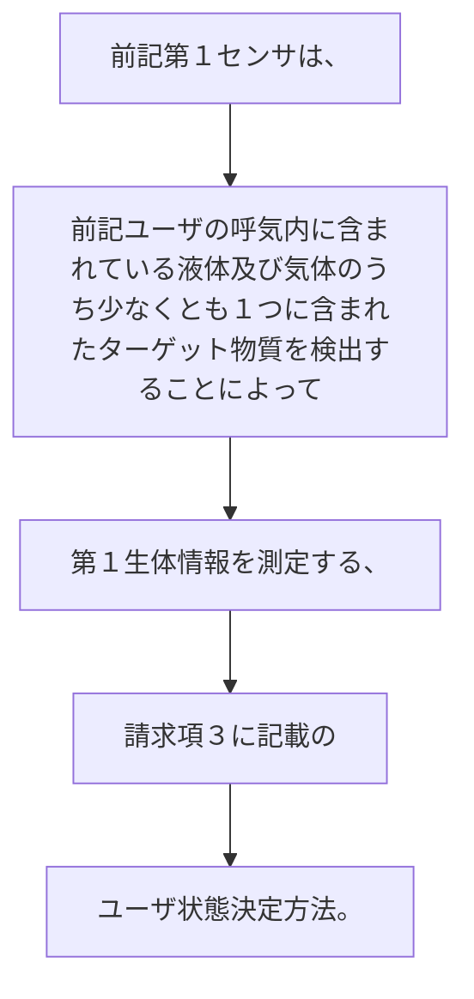

前記第１センサは、前記ユーザの呼気内に含まれている液体及び気体のうち少なくとも１つに含まれたターゲット物質を検出することによって第１生体情報を測定する、請求項３に記載のユーザ状態決定方法。

```mermaid
flowchart TD
A[前記第１センサは、]
B[前記ユーザの呼気内に含まれている液体及び気体のうち少なくとも１つに含まれたターゲット物質を検出することによって]
C[第１生体情報を測定する、]
D[請求項３に記載の]
E[ユーザ状態決定方法。]
A --> B
B --> C
C --> D
D --> E
```