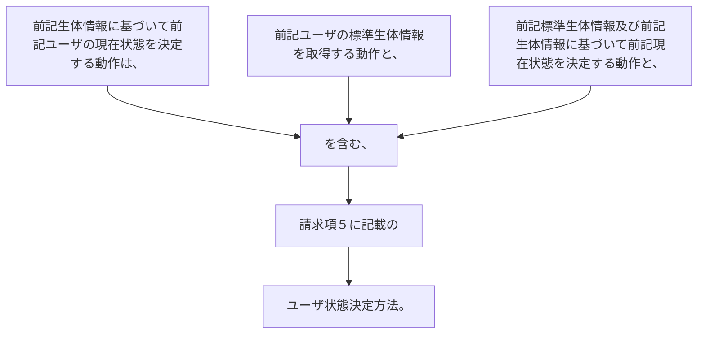

```mermaid
flowchart TD
A[前記生体情報に基づいて前記ユーザの現在状態を決定する動作は、]
B[前記ユーザの標準生体情報を取得する動作と、]
C[前記標準生体情報及び前記生体情報に基づいて前記現在状態を決定する動作と、]
D[を含む、]
E[請求項５に記載の]
F[ユーザ状態決定方法。]
A --> D
B --> D
C --> D
D --> E
E --> F
```