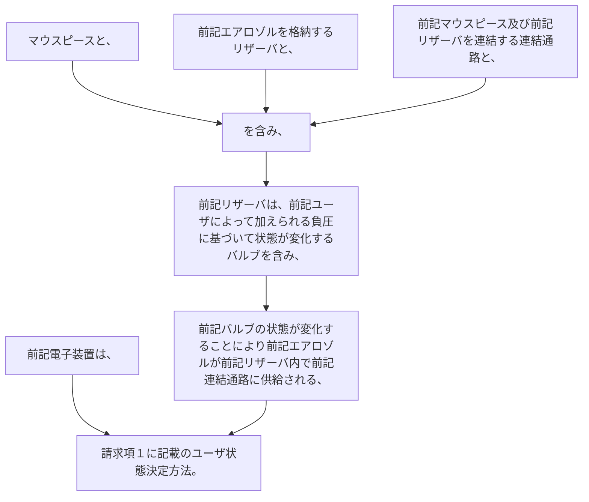

```mermaid
flowchart TD
A[前記電子装置は、]
B[マウスピースと、]
C[前記エアロゾルを格納するリザーバと、]
D[前記マウスピース及び前記リザーバを連結する連結通路と、]
E[を含み、]
F[前記リザーバは、前記ユーザによって加えられる負圧に基づいて状態が変化するバルブを含み、]
G[前記バルブの状態が変化することにより前記エアロゾルが前記リザーバ内で前記連結通路に供給される、]
H[請求項１に記載のユーザ状態決定方法。]
A --> H
B --> E
C --> E
D --> E
E --> F
F --> G
G --> H
```