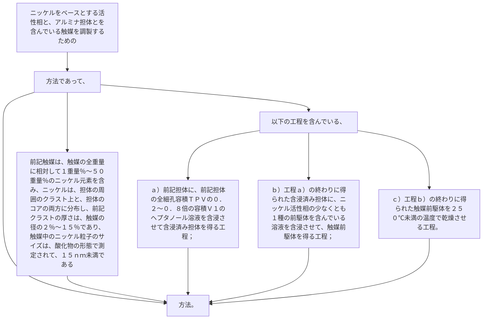

```mermaid
flowchart TD
A[ニッケルをベースとする活性相と、アルミナ担体とを含んでいる触媒を調製するための]
B[方法であって、]
C[前記触媒は、触媒の全重量に相対して１重量％～５０重量％のニッケル元素を含み、ニッケルは、担体の周囲のクラスト上と、担体のコアの両方に分布し、前記クラストの厚さは、触媒の径の２％～１５％であり、触媒中のニッケル粒子のサイズは、酸化物の形態で測定されて、１５ｎｍ未満である]
D[以下の工程を含んでいる、]
E[ａ）前記担体に、前記担体の全細孔容積ＴＰＶの０．２～０．８倍の容積Ｖ１のヘプタノール溶液を含浸させて含浸済み担体を得る工程；]
F[ｂ）工程ａ）の終わりに得られた含浸済み担体に、ニッケル活性相の少なくとも１種の前駆体を含んでいる溶液を含浸させて、触媒前駆体を得る工程；]
G[ｃ）工程ｂ）の終わりに得られた触媒前駆体を２５０℃未満の温度で乾燥させる工程。]
H[方法。]

A --> B
B --> H
B --> C
B --> D
D --> E
D --> F
D --> G
C --> H
E --> H
F --> H
G --> H
```