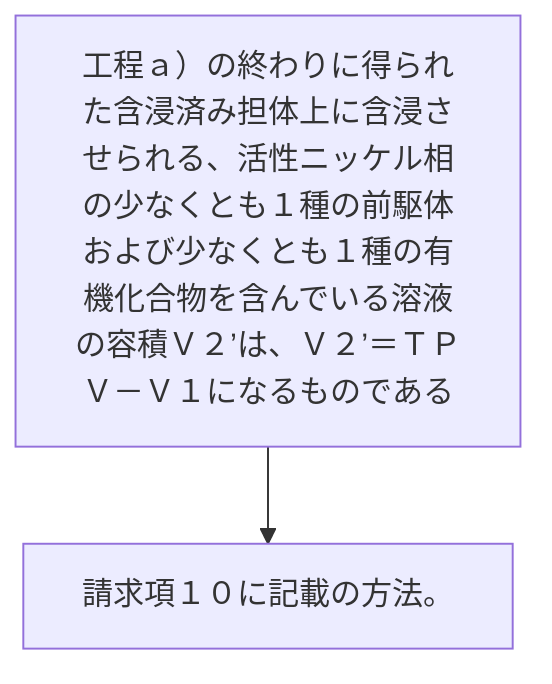

工程ａ）の終わりに得られた含浸済み担体上に含浸させられる、活性ニッケル相の少なくとも１種の前駆体および少なくとも１種の有機化合物を含んでいる溶液の容積Ｖ２’は、Ｖ２’＝ＴＰＶ－Ｖ１になるものである、請求項１０に記載の方法。

```mermaid
flowchart TD
A[工程ａ）の終わりに得られた含浸済み担体上に含浸させられる、活性ニッケル相の少なくとも１種の前駆体および少なくとも１種の有機化合物を含んでいる溶液の容積Ｖ２’は、Ｖ２’＝ＴＰＶ－Ｖ１になるものである]
B[請求項１０に記載の方法。]
A --> B
```