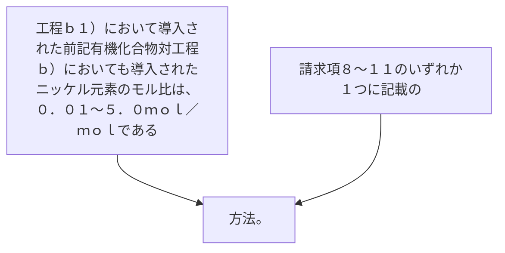

工程ｂ１）において導入された前記有機化合物対工程ｂ）においても導入されたニッケル元素のモル比は、０．０１～５．０ｍｏｌ／ｍｏｌである、請求項８～１１のいずれか１つに記載の方法。

```mermaid
flowchart TD
A[工程ｂ１）において導入された前記有機化合物対工程ｂ）においても導入されたニッケル元素のモル比は、０．０１～５．０ｍｏｌ／ｍｏｌである]
B[請求項８～１１のいずれか１つに記載の]
C[方法。]
A --> C
B --> C
```