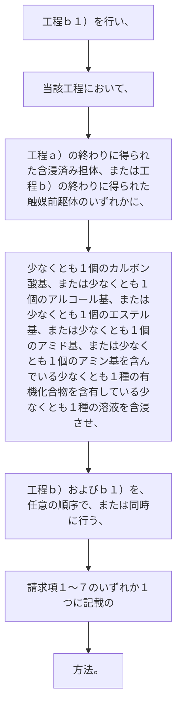

```mermaid
flowchart TD
A[工程ｂ１）を行い、]
B[当該工程において、]
C[工程ａ）の終わりに得られた含浸済み担体、または工程ｂ）の終わりに得られた触媒前駆体のいずれかに、]
D[少なくとも１個のカルボン酸基、または少なくとも１個のアルコール基、または少なくとも１個のエステル基、または少なくとも１個のアミド基、または少なくとも１個のアミン基を含んでいる少なくとも１種の有機化合物を含有している少なくとも１種の溶液を含浸させ、]
E[工程ｂ）およびｂ１）を、任意の順序で、または同時に行う、]
F[請求項１～７のいずれか１つに記載の]
G[方法。]
A --> B
B --> C
C --> D
D --> E
E --> F
F --> G
```