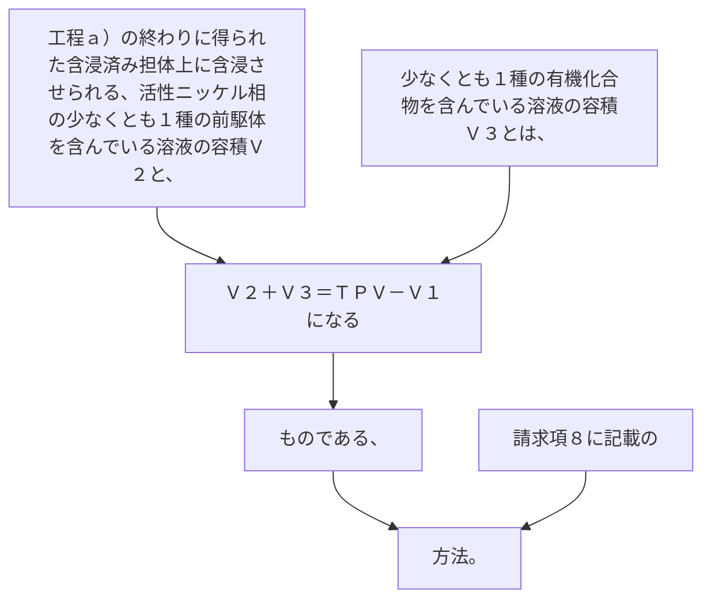

工程ａ）の終わりに得られた含浸済み担体上に含浸させられる、活性ニッケル相の少なくとも１種の前駆体を含んでいる溶液の容積Ｖ２と、少なくとも１種の有機化合物を含んでいる溶液の容積Ｖ３とは、Ｖ２＋Ｖ３＝ＴＰＶ－Ｖ１になるものである、請求項８に記載の方法。

```mermaid
flowchart TD
A[工程ａ）の終わりに得られた含浸済み担体上に含浸させられる、活性ニッケル相の少なくとも１種の前駆体を含んでいる溶液の容積Ｖ２と、]
B[少なくとも１種の有機化合物を含んでいる溶液の容積Ｖ３とは、]
C[Ｖ２＋Ｖ３＝ＴＰＶ－Ｖ１になる]
D[ものである、]
E[請求項８に記載の]
F[方法。]
A --> C
B --> C
C --> D
D --> F
E --> F
```