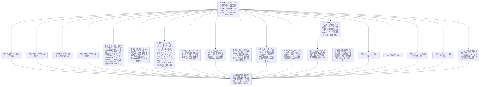

```mermaid
flowchart TD
A[式（ＩＡ）若しくは（ＩＢ）の化合物又はその薬学的に許容される塩、溶媒和物、水和物、互変異性体、光学異性体、Ｎ－オキシド、及び／若しくはプロドラッグであって、式中]
B[Ｘが、Ｎ及びＣＲ^４から選択され；]
C[Ｙが、Ｎ及びＣＲ^５から選択され；]
D[ＣＲ^４及びＣＲ^５の少なくとも１つが存在し；]
E[Ｚが、Ｎ及びＣＲ^６から選択され；]
F[Ｒ^１が、Ｈ、Ｃ１－Ｃ６アルキル及び－ＳＯ２Ｒ^７からなる群より選択され、前記Ｃ１－Ｃ６アルキルが任意選択で、ハロ、オキソ、－ＮＲ^ａＲ^ｂ、－Ｃ（Ｏ）ＮＲ^ａＲ^ｂ、－Ｃ（Ｏ）ＯＲ^ｃ、－ＯＲ^ｃから独立して選択される１つ又は複数の置換基で置換され；]
G[Ｒ^２及びＲ^３が、Ｈ、ハロ、及びＣ１－Ｃ６アルキルからなる群より独立して選択され、前記Ｃ１－Ｃ６アルキルが任意選択で、１つ又は複数のハロ原子で置換され；]
H[Ｒ^４及びＲ^５が、Ｈ、－Ｃ（Ｏ）ＯＲ^ｃ、－Ｃ（Ｏ）Ｎ（Ｒ^ｄ）ＳＯ２Ｒ^ｅ、－Ｃ（Ｏ）Ｎ＝Ｓ（Ｏ）Ｒ^ｅ２、－Ｎ＝Ｓ（Ｏ）Ｒ^ｅ２、－Ｎ（Ｒ^ｄ）Ｃ（Ｏ）Ｎ＝Ｓ（Ｏ）Ｒ^ｅ２、－Ｎ（Ｒ^ｄ）Ｃ（Ｏ）ＮＲ^ｅ２、－Ｎ（Ｒ^ｄ）ＳＯ２Ｒ^ｅ、－Ｓ（Ｏ）（＝ＮＲ^ｄ）Ｒ^ｅ、からなる群より独立して選択され；]
I[Ｒ^６が、Ｈ及びＣ１－Ｃ６アルキルから選択され、前記Ｃ１－Ｃ６アルキルが任意選択で、１つ又は複数のハロ原子で置換され；]
J[Ｒ^７が、Ｈ及びＣ１－Ｃ６アルキルから選択され、前記Ｃ１－Ｃ６アルキルが任意選択で、１つ又は複数のハロ原子で置換され；]
K[Ｒ^８が、Ｃ１－Ｃ６アルキル、－ＯＨ、及び－ＮＲ^ａＲ^ｂから選択され、前記Ｃ１－Ｃ６アルキルが任意選択で、１つ又は複数のハロ原子で置換され；]
L[Ｒ^９が、Ｃ１－Ｃ６アルキル、－ＯＨ、オキソ、及び－ＮＲ^ａＲ^ｂから選択され、前記Ｃ１－Ｃ６アルキルが任意選択で、１つ又は複数のハロ原子で置換され；]
M[Ｒ^１０が、Ｈ及びＣ１－Ｃ６アルキルから選択され、前記Ｃ１－Ｃ６アルキルが任意選択で、１つ又は複数のハロ原子で置換され；]
N[Ｒ^ａ、Ｒ^ｂ、Ｒ^ｃ、Ｒ^ｄ及びＲ^ｅがそれぞれ、Ｈ及びＣ１－Ｃ６アルキルから独立して選択され、前記Ｃ１－Ｃ６アルキルが任意選択で、１つ若しくは複数のハロ原子で置換され、]
O[又はＲ^ａ及びＲ^ｂが、それらが結合している窒素原子と一緒になって５若しくは６員複素環を形成することができ、]
P[又は同じ原子に結合している２つのＲ^ｅ基が、それらが結合している原子と一緒になって５若しくは６員複素環を形成することができ；]
Q[ｍが、０、１、２、３又は４であり；]
R[ｎが、１又は２であり；]
S[ｐが、０、１、２、３又は４であり；且つ]
T[ｑが、０、１、２、３又は４であり；]
U[Ｒ^１が、Ｈ又は任意選択で置換されたＣ１－Ｃ６アルキルである場合、Ｒ^４とＲ^５のうちの少なくとも１つが存在し、Ｈではない]
V[化合物又はその薬学的に許容される塩、溶媒和物、水和物、互変異性体、光学異性体、Ｎ－オキシド、及び／若しくはプロドラッグ。]

A --> B
A --> C
A --> D
A --> E
A --> F
A --> G
A --> H
A --> I
A --> J
A --> K
A --> L
A --> M
A --> N
N --> O
N --> P
A --> Q
A --> R
A --> S
A --> T
A --> U

B --> V
C --> V
D --> V
E --> V
F --> V
G --> V
H --> V
I --> V
J --> V
K --> V
L --> V
M --> V
O --> V
P --> V
Q --> V
R --> V
S --> V
T --> V
U --> V
```