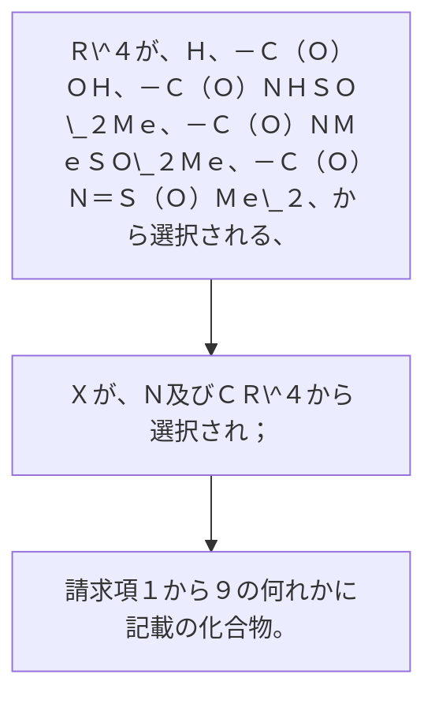

Ｘが、Ｎ及びＣＲ
^４
から選択され；Ｒ
^４
が、Ｈ、－Ｃ（Ｏ）ＯＨ、－Ｃ（Ｏ）ＮＨＳＯ
２
Ｍｅ、
－Ｃ（Ｏ）ＮＭｅＳＯ
２
Ｍｅ、－Ｃ（Ｏ）Ｎ＝Ｓ（Ｏ）Ｍｅ
２
、
から選択される、請求項１から９の何れかに記載の化合物。

```mermaid
flowchart TD
A[Ｘが、Ｎ及びＣＲ\^４から選択され；]
B[Ｒ\^４が、Ｈ、－Ｃ（Ｏ）ＯＨ、－Ｃ（Ｏ）ＮＨＳＯ\_２Ｍｅ、－Ｃ（Ｏ）ＮＭｅＳＯ\_２Ｍｅ、－Ｃ（Ｏ）Ｎ＝Ｓ（Ｏ）Ｍｅ\_２、から選択される、]
C[請求項１から９の何れかに記載の化合物。]
B --> A
A --> C
```