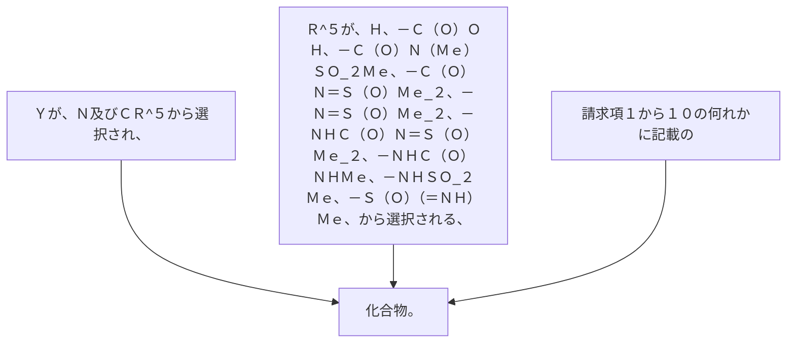

Ｙが、Ｎ及びＣＲ
^５
から選択され、Ｒ
^５
が、Ｈ、－Ｃ（Ｏ）ＯＨ、－Ｃ（Ｏ）Ｎ（Ｍｅ）ＳＯ
２
Ｍｅ、
－Ｃ（Ｏ）Ｎ＝Ｓ（Ｏ）Ｍｅ
２
、－Ｎ＝Ｓ（Ｏ）Ｍｅ
２
、－ＮＨＣ（Ｏ）Ｎ＝Ｓ（Ｏ）Ｍｅ
２
、－ＮＨＣ（Ｏ）ＮＨＭｅ、
－ＮＨＳＯ
２
Ｍｅ、－Ｓ（Ｏ）（＝ＮＨ）Ｍｅ、
から選択される、請求項１から１０の何れかに記載の化合物。

```mermaid
flowchart TD
A[Ｙが、Ｎ及びＣＲ^５から選択され、]
B[Ｒ^５が、Ｈ、－Ｃ（Ｏ）ＯＨ、－Ｃ（Ｏ）Ｎ（Ｍｅ）ＳＯ_２Ｍｅ、－Ｃ（Ｏ）Ｎ＝Ｓ（Ｏ）Ｍｅ_２、－Ｎ＝Ｓ（Ｏ）Ｍｅ_２、－ＮＨＣ（Ｏ）Ｎ＝Ｓ（Ｏ）Ｍｅ_２、－ＮＨＣ（Ｏ）ＮＨＭｅ、－ＮＨＳＯ_２Ｍｅ、－Ｓ（Ｏ）（＝ＮＨ）Ｍｅ、から選択される、]
C[請求項１から１０の何れかに記載の]
D[化合物。]
A --> D
B --> D
C --> D
```