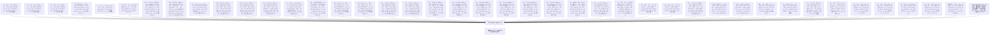

```mermaid
flowchart TD
    A[2－［［４－［２－メチル－４－（４－ピリジル）ピラゾール－３－イル］フェノキシ］メチル］キノリン－４－カルボン酸]
    B[2－［［４－［２－メチル－４－（４－ピリジル）ピラゾール－３－イル］フェノキシ］メチル］キノリン－３－カルボン酸]
    C[2－［［４－［１－メチル－４－（４－ピリジル）ピラゾール－３－イル］フェノキシ］メチル］キノリン－３－カルボン酸]
    D[アンモニウム２－［［４－［１－メチル－４－（４－ピリジル）ピラゾール－３－イル］フェノキシ］メチル］キノリン－４－カルボキシレート]
    E[2－［４－（４－ピリジル）－３－［４－（２－キノリルメトキシ）フェニル］ピラゾール－１－イル］酢酸]
    F[2－［［４－［１－メチルスルホニル－４－（４－ピリジル）ピラゾール－３－イル］フェノキシ］メチル］キノリン]
    G[Ｎ－［ジメチル（オキソ）－λ６－スルファニリデン］－５－メチル－２－［［４－［１－メチル－４－（４－ピリジル）ピラゾール－３－イル］フェノキシ］メチル］キノリン－３－カルボキサミド]
    H[Ｎ－［ジメチル（オキソ）－λ６－スルファニリデン］－２－［［４－［４－（４－ピリジル）－１－（２，２，２－トリフルオロエチル）ピラゾール－３－イル］フェノキシ］メチル］キノリン－４－カルボキサミド]
    I[２－［［４－［１－メチル－４－（４－ピリジル）ピラゾール－３－イル］フェノキシ］メチル］－Ｎ－メチルスルホニル－キノリン－３－カルボキサミド]
    J[Ｎ－［ジメチル（オキソ）－λ６－スルファニリデン］－２－［［４－［１－メチル－４－（４－ピリジル）ピラゾール－３－イル］フェノキシ］メチル］キノリン－３－カルボキサミド]
    K[Ｎ－［ジメチル（オキソ）－λ６－スルファニリデン］－２－［［４－［１－メチル－４－（４－ピリジル）ピラゾール－３－イル］フェノキシ］メチル］キノリン－４－カルボキサミド]
    L[Ｎ－［ジメチル（オキソ）－λ６－スルファニリデン］－２－［［４－［４－（４－ピリジル）－１Ｈ－ピラゾール－３－イル］フェノキシ］メチル］キノリン－４－カルボキサミド]
    M[２－［［４－［１－メチル－４－（４－ピリジル）ピラゾール－３－イル］フェノキシ］メチル］－Ｎ－（１－オキソチオラン－１－イリデン）キノリン－３－カルボキサミド]
    N[Ｎ－（シクロプロピル－メチル－オキソ－λ６－スルファニリデン）－２－［［４－［１－メチル－４－（４－ピリジル）ピラゾール－３－イル］フェノキシ］メチル］キノリン－３－カルボキサミド]
    O[Ｎ－メチル－２－［［４－［１－メチル－４－（４－ピリジル）ピラゾール－３－イル］フェノキシ］メチル］－Ｎ－メチルスルホニル－キノリン－３－カルボキサミド]
    P[Ｎ－メチル－２－［［４－［１－メチル－４－（４－ピリジル）ピラゾール－３－イル］フェノキシ］メチル］－Ｎ－メチルスルホニル－キノリン－４－カルボキサミド]
    Q[Ｎ－［ジメチル（オキソ）－λ６－スルファニリデン］－２－［［４－［１－メチル－４－（４－ピリジル）ピラゾール－３－イル］フェノキシ］メチル］キナゾリン－４－カルボキサミド]
    R[Ｎ－［ジメチル（オキソ）－λ６－スルファニリデン］－３－［［４－［１－メチル－４－（４－ピリジル）ピラゾール－３－イル］フェノキシ］メチル］キノキサリン－２－カルボキサミド]
    S[Ｎ－［ジメチル（オキソ）－λ６－スルファニリデン］－２－［［４－［１－メチル－４－（４－ピリジル）ピラゾール－３－イル］フェノキシ］メチル］－１，５－ナフチリジン－３－カルボキサミド]
    T[Ｎ－［ジメチル（オキソ）－λ６－スルファニリデン］－７－フルオロ－２－［［４－［１－メチル－４－（４－ピリジル）ピラゾール－３－イル］フェノキシ］メチル］キノリン－３－カルボキサミド]
    U[Ｎ－［ジメチル（オキソ）－λ６－スルファニリデン］－６－フルオロ－２－［［４－［１－メチル－４－（４－ピリジル）ピラゾール－３－イル］フェノキシ］メチル］キノリン－３－カルボキサミド]
    V[Ｎ－［ジメチル（オキソ）－λ６－スルファニリデン］－５－フルオロ－２－［［４－［１－メチル－４－（４－ピリジル）ピラゾール－３－イル］フェノキシ］メチル］キノリン－３－カルボキサミド]
    W[Ｎ－［ジメチル（オキソ）－λ６－スルファニリデン］－６－メチル－２－［［４－［１－メチル－４－（４－ピリジル）ピラゾール－３－イル］フェノキシ］メチル］キノリン－３－カルボキサミド]
    X[Ｎ－［ジメチル（オキソ）－λ６－スルファニリデン］－６－フルオロ－２－［［４－［１－メチル－４－（４－ピリジル）ピラゾール－３－イル］フェノキシ］メチル］キノリン－４－カルボキサミド]
    Y[５－クロロ－Ｎ－［ジメチル（オキソ）－λ６－スルファニリデン］－２－［［４－［１－メチル－４－（４－ピリジル）ピラゾール－３－イル］フェノキシ］メチル］キノリン－４－カルボキサミド]
    Z[Ｎ－［ジメチル（オキソ）－λ６－スルファニリデン］－２－［［４－［１－エチル－４－（４－ピリジル）ピラゾール－３－イル］フェノキシ］メチル］キノリン－４－カルボキサミド]
    AA[２－［［４－［１－シクロプロピル－４－（４－ピリジル）ピラゾール－３－イル］フェノキシ］メチル］－Ｎ－［ジメチル（オキソ）－λ６－スルファニリデン］キノリン－４－カルボキサミド]
    AB[２－［［４－［４－（４－ピリジル）－１Ｈ－ピラゾール－３－イル］フェノキシ］メチル］キノリン－３－カルボン酸]
    AC[２－［［４－［４－（４－ピリジル）－１Ｈ－ピラゾール－３－イル］フェノキシ］メチル］キノリン－４－カルボン酸]
    AD[Ｎ－［ジメチル（オキソ）－λ６－スルファニリデン］－２－［［４－［４－（４－ピリジル）－１Ｈ－ピラゾール－３－イル］フェノキシ］メチル］キノリン－３－カルボキサミド]
    AE[ジメチル－オキソ－［［２－［［４－［４－（４－ピリジル）－１Ｈ－ピラゾール－３－イル］フェノキシ］メチル］－４－キノリル］イミノ］－λ６－サルファン]
    AF[イミノ－メチル－オキソ－［２－［［４－［４－（４－ピリジル）－１Ｈ－ピラゾール－３－イル］フェノキシ］メチル］－４－キノリル］－λ６－サルファン]
    AG[Ｎ－［２－［［４－［１－メチル－４－（４－ピリジル）ピラゾール－３－イル］フェノキシ］メチル］－４－キノリル］メタンスルホンアミド]
    AH[１－メチル－３－［２－［［４－［１－メチル－４－（４－ピリジル）ピラゾール－３－イル］フェノキシ］メチル］－４－キノリル］尿素]
    AI[１－［ジメチル（オキソ）－λ６－スルファニリデン］－３－［２－［［４－［１－メチル－４－（４－ピリジル）ピラゾール－３－イル］フェノキシ］メチル］－４－キノリル］尿素]
    AJ[４－［２－［［４－［１－メチル－４－（４－ピリジル）ピラゾール－３－イル］フェノキシ］メチル］キナゾリン－４－イル］－１，４－チアジナン－１，１－ジオキシド]
    AK[４－［２－［［４－［１－メチル－４－（４－ピリジル）ピラゾール－３－イル］フェノキシ］メチル］キナゾリン－４－イル］ピペラジン－２－オン]
    AL[１－［２－［［４－［１－メチル－４－（４－ピリジル）ピラゾール－３－イル］フェノキシ］メチル］キナゾリン－４－イル］アゼチジン－３－アミン]
    AM[２－［［４－［１－メチル－４－（４－ピリジル）ピラゾール－３－イル］フェノキシ］メチル］－４－ピペラジン－１－イル－キナゾリン]
    AN[１－［３－［［４－［１－メチル－４－（４－ピリジル）ピラゾール－３－イル］フェノキシ］メチル］キノキサリン－２－イル］アゼチジン－３－アミン]
    AO[及び ２－［［４－［１－メチル－４－（４－ピリジル）ピラゾール－３－イル］フェノキシ］メチル］－３－ピペラジン－１－イル－キノキサリン]
    AP[又はその薬学的に許容される塩、溶媒和物、水和物、互変異性体、光学異性体、Ｎ－オキシド、及び／若しくはプロドラッグ]
    AQ[からなる群より選択される]
    AR[請求項１から１１の何れかに記載の化合物。]

    A --> AQ
    B --> AQ
    C --> AQ
    D --> AQ
    E --> AQ
    F --> AQ
    G --> AQ
    H --> AQ
    I --> AQ
    J --> AQ
    K --> AQ
    L --> AQ
    M --> AQ
    N --> AQ
    O --> AQ
    P --> AQ
    Q --> AQ
    R --> AQ
    S --> AQ
    T --> AQ
    U --> AQ
    V --> AQ
    W --> AQ
    X --> AQ
    Y --> AQ
    Z --> AQ
    AA --> AQ
    AB --> AQ
    AC --> AQ
    AD --> AQ
    AE --> AQ
    AF --> AQ
    AG --> AQ
    AH --> AQ
    AI --> AQ
    AJ --> AQ
    AK --> AQ
    AL --> AQ
    AM --> AQ
    AN --> AQ
    AO --> AQ
    AP --> AQ
    AQ --> AR
```