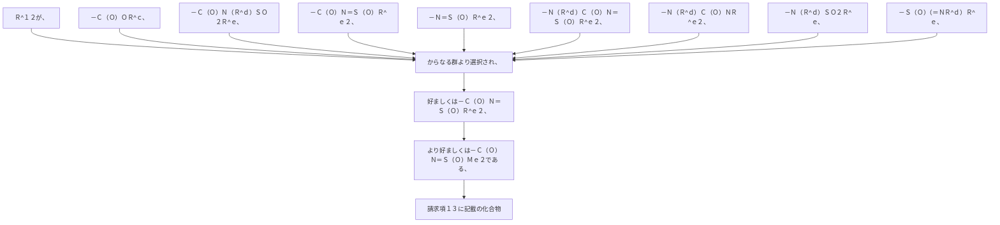

Ｒ
^１２
が、－Ｃ（Ｏ）ＯＲ
^ｃ
、－Ｃ（Ｏ）Ｎ（Ｒ
^ｄ
）ＳＯ
２
Ｒ
^ｅ
、－Ｃ（Ｏ）Ｎ＝Ｓ（Ｏ）Ｒ
^ｅ
２
、－Ｎ＝Ｓ（Ｏ）Ｒ
^ｅ
２
、
－Ｎ（Ｒ
^ｄ
）Ｃ（Ｏ）Ｎ＝Ｓ（Ｏ）Ｒ
^ｅ
２
、－Ｎ（Ｒ
^ｄ
）Ｃ（Ｏ）ＮＲ
^ｅ
２
、－Ｎ（Ｒ
^ｄ
）ＳＯ
２
Ｒ
^ｅ
、－Ｓ（Ｏ）（＝ＮＲ
^ｄ
）Ｒ
^ｅ
、
からなる群より選択され、
好ましくは－Ｃ（Ｏ）Ｎ＝Ｓ（Ｏ）Ｒ
^ｅ
２
、より好ましくは－Ｃ（Ｏ）Ｎ＝Ｓ（Ｏ）Ｍｅ
２
である、請求項１３に記載の化合物
