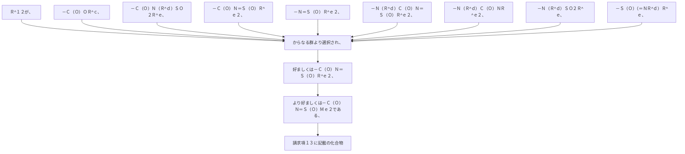

```mermaid
flowchart TD
A[Ｒ^１２が、]
B[－Ｃ（Ｏ）ＯＲ^ｃ、]
C[－Ｃ（Ｏ）Ｎ（Ｒ^ｄ）ＳＯ２Ｒ^ｅ、]
D[－Ｃ（Ｏ）Ｎ＝Ｓ（Ｏ）Ｒ^ｅ２、]
E[－Ｎ＝Ｓ（Ｏ）Ｒ^ｅ２、]
F[－Ｎ（Ｒ^ｄ）Ｃ（Ｏ）Ｎ＝Ｓ（Ｏ）Ｒ^ｅ２、]
G[－Ｎ（Ｒ^ｄ）Ｃ（Ｏ）ＮＲ^ｅ２、]
H[－Ｎ（Ｒ^ｄ）ＳＯ２Ｒ^ｅ、]
I[－Ｓ（Ｏ）（＝ＮＲ^ｄ）Ｒ^ｅ、]
J[からなる群より選択され、]
K[好ましくは－Ｃ（Ｏ）Ｎ＝Ｓ（Ｏ）Ｒ^ｅ２、]
L[より好ましくは－Ｃ（Ｏ）Ｎ＝Ｓ（Ｏ）Ｍｅ２である、]
M[請求項１３に記載の化合物]

A --> J
B --> J
C --> J
D --> J
E --> J
F --> J
G --> J
H --> J
I --> J
J --> K
K --> L
L --> M
```