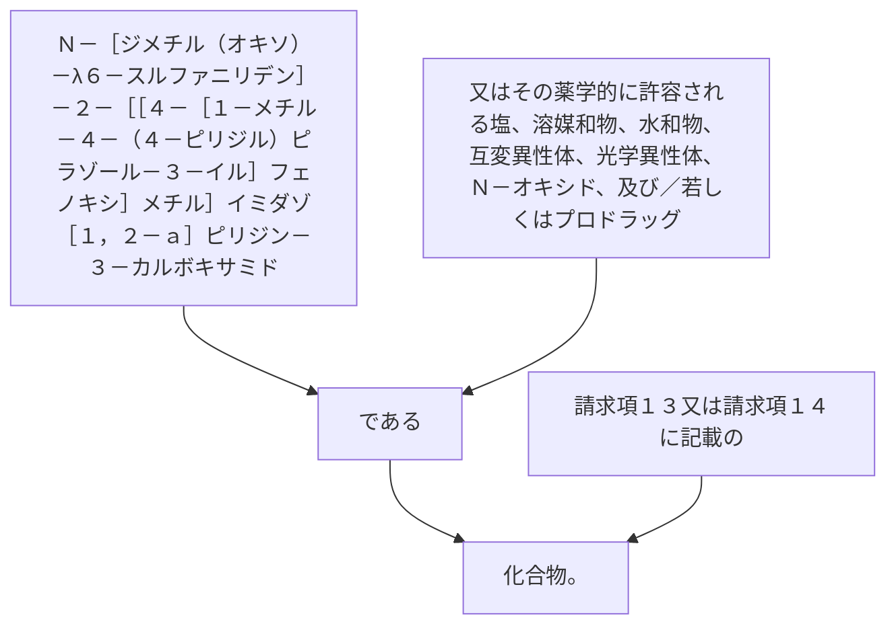

```mermaid
flowchart TD
A[Ｎ－［ジメチル（オキソ）－λ６－スルファニリデン］－２－［［４－［１－メチル－４－（４－ピリジル）ピラゾール－３－イル］フェノキシ］メチル］イミダゾ［１，２－ａ］ピリジン－３－カルボキサミド]
B[又はその薬学的に許容される塩、溶媒和物、水和物、互変異性体、光学異性体、Ｎ－オキシド、及び／若しくはプロドラッグ]
C[である]
D[請求項１３又は請求項１４に記載の]
E[化合物。]
A --> C
B --> C
C --> E
D --> E
```