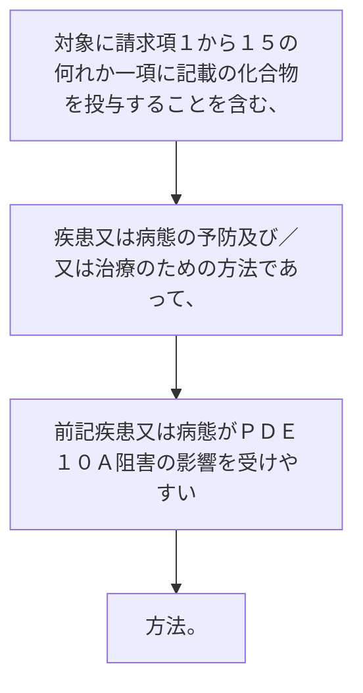

対象に請求項１から１５の何れか一項に記載の化合物を投与することを含む、疾患又は病態の予防及び／又は治療のための方法であって、前記疾患又は病態がＰＤＥ１０Ａ阻害の影響を受けやすい方法。

```mermaid
flowchart TD
A[対象に請求項１から１５の何れか一項に記載の化合物を投与することを含む、]
B[疾患又は病態の予防及び／又は治療のための方法であって、]
C[前記疾患又は病態がＰＤＥ１０Ａ阻害の影響を受けやすい]
D[方法。]
A --> B
B --> C
C --> D
```