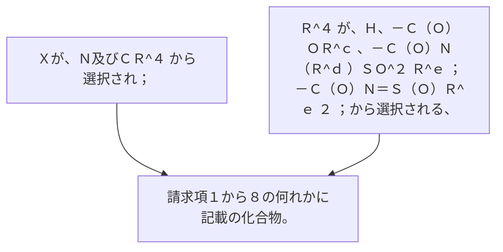

Ｘが、Ｎ及びＣＲ
^４
から選択され；Ｒ
^４
が、Ｈ、－Ｃ（Ｏ）ＯＲ
^ｃ
、－Ｃ（Ｏ）Ｎ（Ｒ
^ｄ
）ＳＯ
２
Ｒ
^ｅ
；
－Ｃ（Ｏ）Ｎ＝Ｓ（Ｏ）Ｒ
^ｅ
２
；
から選択される、請求項１から８の何れかに記載の化合物。

```mermaid
flowchart TD
A[Ｘが、Ｎ及びＣＲ^４ から選択され；]
B[Ｒ^４ が、Ｈ、－Ｃ（Ｏ）ＯＲ^ｃ 、－Ｃ（Ｏ）Ｎ（Ｒ^ｄ ）ＳＯ^２ Ｒ^ｅ ；－Ｃ（Ｏ）Ｎ＝Ｓ（Ｏ）Ｒ^ｅ ２ ；から選択される、]
C[請求項１から８の何れかに記載の化合物。]
A --> C
B --> C
```