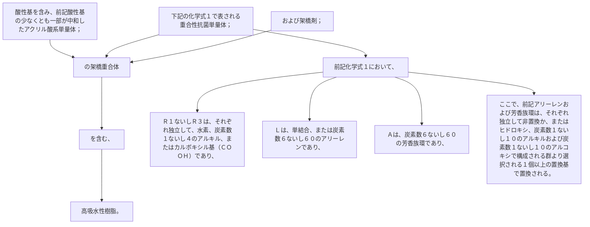

酸性基を含み、前記酸性基の少なくとも一部が中和したアクリル酸系単量体；下記の化学式１で表される重合性抗菌単量体；および架橋剤；の架橋重合体を含む、
高吸水性樹脂。
前記化学式１において、
Ｒ
１
ないしＲ
３
は、それぞれ独立して、水素、炭素数１ないし４のアルキル、またはカルボキシル基（ＣＯＯＨ）であり、
Ｌは、単結合、または炭素数６ないし６０のアリーレンであり、
Ａは、炭素数６ないし６０の芳香族環であり、
ここで、前記アリーレンおよび芳香族環は、それぞれ独立して非置換か、またはヒドロキシ、炭素数１ないし１０のアルキルおよび炭素数１ないし１０のアルコキシで構成される群より選択される１個以上の置換基で置換される。
