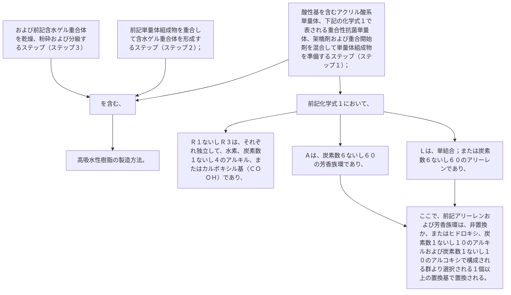

```mermaid
flowchart TD
A[酸性基を含むアクリル酸系単量体、下記の化学式１で表される重合性抗菌単量体、架橋剤および重合開始剤を混合して単量体組成物を準備するステップ（ステップ１）；]
B[前記単量体組成物を重合して含水ゲル重合体を形成するステップ（ステップ２）；]
C[および前記含水ゲル重合体を乾燥、粉砕および分級するステップ（ステップ３）]
D[を含む、]
E[高吸水性樹脂の製造方法。]

F[前記化学式１において、]
G[Ｒ１ないしＲ３は、それぞれ独立して、水素、炭素数１ないし４のアルキル、またはカルボキシル基（ＣＯＯＨ）であり、]
H[Ｌは、単結合；または炭素数６ないし６０のアリーレンであり、]
I[Ａは、炭素数６ないし６０の芳香族環であり、]
J[ここで、前記アリーレンおよび芳香族環は、非置換か、またはヒドロキシ、炭素数１ないし１０のアルキルおよび炭素数１ないし１０のアルコキシで構成される群より選択される１個以上の置換基で置換される。]

A --> D
B --> D
C --> D
D --> E

A --> F
F --> G
F --> H
F --> I
H --> J
I --> J
```