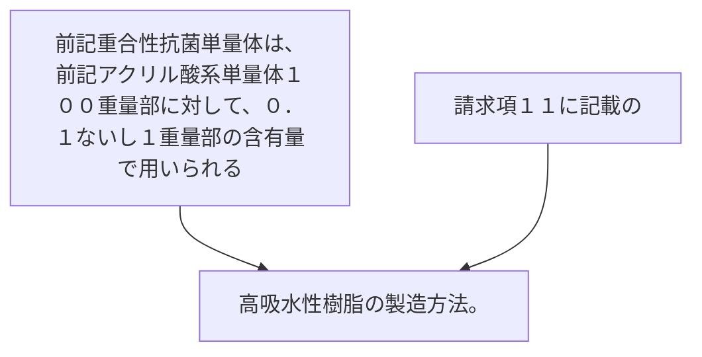

前記重合性抗菌単量体は、前記アクリル酸系単量体１００重量部に対して、０．１ないし１重量部の含有量で用いられる、
請求項１１に記載の高吸水性樹脂の製造方法。

```mermaid
flowchart TD
A[前記重合性抗菌単量体は、前記アクリル酸系単量体１００重量部に対して、０．１ないし１重量部の含有量で用いられる]
B[請求項１１に記載の]
C[高吸水性樹脂の製造方法。]
A --> C
B --> C
```