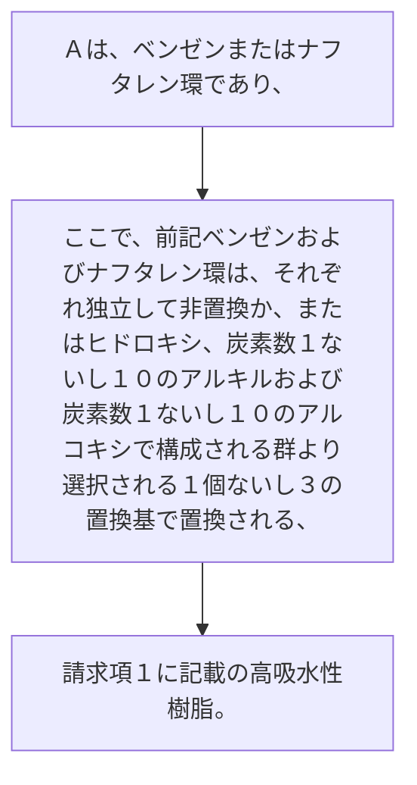

Ａは、ベンゼンまたはナフタレン環であり、
ここで、前記ベンゼンおよびナフタレン環は、それぞれ独立して非置換か、またはヒドロキシ、炭素数１ないし１０のアルキルおよび炭素数１ないし１０のアルコキシで構成される群より選択される１個ないし３の置換基で置換される、
請求項１に記載の高吸水性樹脂。

```mermaid
flowchart TD
A[Ａは、ベンゼンまたはナフタレン環であり、]
B[ここで、前記ベンゼンおよびナフタレン環は、それぞれ独立して非置換か、またはヒドロキシ、炭素数１ないし１０のアルキルおよび炭素数１ないし１０のアルコキシで構成される群より選択される１個ないし３の置換基で置換される、]
C[請求項１に記載の高吸水性樹脂。]
A --> B
B --> C
```