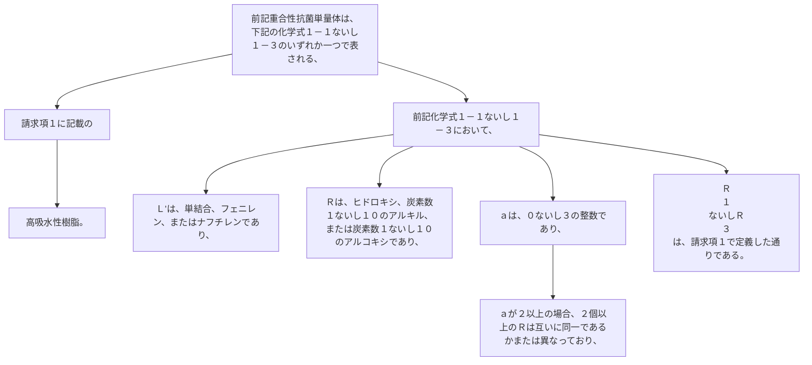

```mermaid
flowchart TD
A[前記重合性抗菌単量体は、下記の化学式１－１ないし１－３のいずれか一つで表される、]
B[請求項１に記載の]
C[高吸水性樹脂。]
D[前記化学式１－１ないし１－３において、]
E[Ｌ’は、単結合、フェニレン、またはナフチレンであり、]
F[Ｒは、ヒドロキシ、炭素数１ないし１０のアルキル、または炭素数１ないし１０のアルコキシであり、]
G[ａは、０ないし３の整数であり、]
H[ａが２以上の場合、２個以上のＲは互いに同一であるかまたは異なっており、]
I[Ｒ
１
ないしＲ
３
は、請求項１で定義した通りである。]

A --> B
B --> C
A --> D
D --> E
D --> F
D --> G
D --> I
G --> H
```