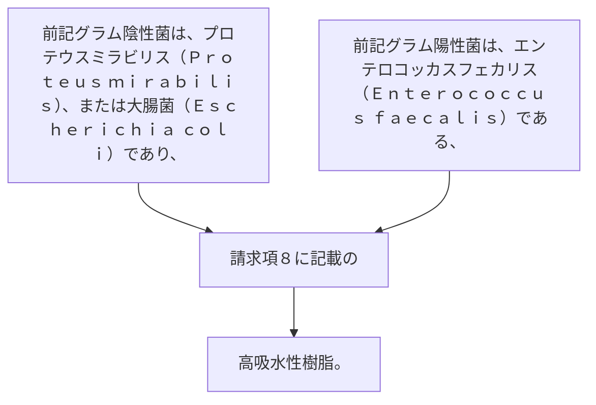

```mermaid
flowchart TD
A[前記グラム陰性菌は、プロテウスミラビリス（Ｐｒｏｔｅｕｓ ｍｉｒａｂｉｌｉｓ）、または大腸菌（Ｅｓｃｈｅｒｉｃｈｉａ ｃｏｌｉ）であり、]
B[前記グラム陽性菌は、エンテロコッカスフェカリス（Ｅｎｔｅｒｏｃｏｃｃｕｓ ｆａｅｃａｌｉｓ）である、]
C[請求項８に記載の]
D[高吸水性樹脂。]
A --> C
B --> C
C --> D
```