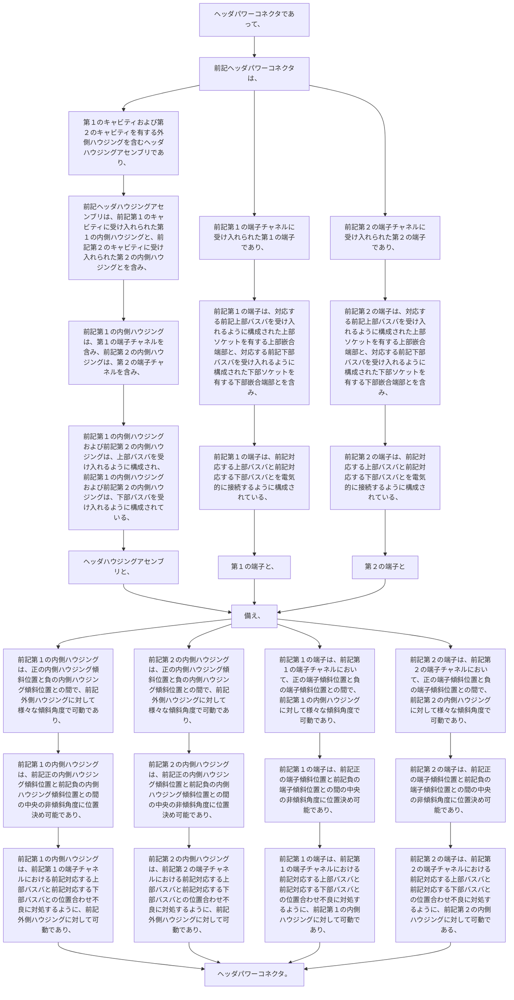

ヘッダパワーコネクタであって、
前記ヘッダパワーコネクタは、
●  第１のキャビティおよび第２のキャビティを有する外側ハウジングを含むヘッダハウジングアセンブリであり、
前記ヘッダハウジングアセンブリは、前記第１のキャビティに受け入れられた第１の内側ハウジングと、前記第２のキャビティに受け入れられた第２の内側ハウジングとを含み、
前記第１の内側ハウジングは、第１の端子チャネルを含み、前記第２の内側ハウジングは、第２の端子チャネルを含み、
前記第１の内側ハウジングおよび前記第２の内側ハウジングは、上部バスバを受け入れるように構成され、前記第１の内側ハウジングおよび前記第２の内側ハウジングは、下部バスバを受け入れるように構成されている、ヘッダハウジングアセンブリと、
●  前記第１の端子チャネルに受け入れられた第１の端子であり、
前記第１の端子は、対応する前記上部バスバを受け入れるように構成された上部ソケットを有する上部嵌合端部と、対応する前記下部バスバを受け入れるように構成された下部ソケットを有する下部嵌合端部とを含み、
前記第１の端子は、前記対応する上部バスバと前記対応する下部バスバとを電気的に接続するように構成されている、第１の端子と、
●  前記第２の端子チャネルに受け入れられた第２の端子であり、
前記第２の端子は、対応する前記上部バスバを受け入れるように構成された上部ソケットを有する上部嵌合端部と、対応する前記下部バスバを受け入れるように構成された下部ソケットを有する下部嵌合端部とを含み、
前記第２の端子は、前記対応する上部バスバと前記対応する下部バスバとを電気的に接続するように構成されている、第２の端子と
を備え、
-  前記第１の内側ハウジングは、正の内側ハウジング傾斜位置と負の内側ハウジング傾斜位置との間で、前記外側ハウジングに対して様々な傾斜角度で可動であり、
前記第１の内側ハウジングは、前記正の内側ハウジング傾斜位置と前記負の内側ハウジング傾斜位置との間の中央の非傾斜角度に位置決め可能であり、
前記第１の内側ハウジングは、前記第１の端子チャネルにおける前記対応する上部バスバと前記対応する下部バスバとの位置合わせ不良に対処するように、前記外側ハウジングに対して可動であり、
-  前記第２の内側ハウジングは、正の内側ハウジング傾斜位置と負の内側ハウジング傾斜位置との間で、前記外側ハウジングに対して様々な傾斜角度で可動であり、
前記第２の内側ハウジングは、前記正の内側ハウジング傾斜位置と前記負の内側ハウジング傾斜位置との間の中央の非傾斜角度に位置決め可能であり、
前記第２の内側ハウジングは、前記第２の端子チャネルにおける前記対応する上部バスバと前記対応する下部バスバとの位置合わせ不良に対処するように、前記外側ハウジングに対して可動であり、
-  前記第１の端子は、前記第１の端子チャネルにおいて、正の端子傾斜位置と負の端子傾斜位置との間で、前記第１の内側ハウジングに対して様々な傾斜角度で可動であり、
前記第１の端子は、前記正の端子傾斜位置と前記負の端子傾斜位置との間の中央の非傾斜角度に位置決め可能であり、
前記第１の端子は、前記第１の端子チャネルにおける前記対応する上部バスバと前記対応する下部バスバとの位置合わせ不良に対処するように、前記第１の内側ハウジングに対して可動であり、
-  前記第２の端子は、前記第２の端子チャネルにおいて、正の端子傾斜位置と負の端子傾斜位置との間で、前記第２の内側ハウジングに対して様々な傾斜角度で可動であり、
前記第２の端子は、前記正の端子傾斜位置と前記負の端子傾斜位置との間の中央の非傾斜角度に位置決め可能であり、
前記第２の端子は、前記第２の端子チャネルにおける前記対応する上部バスバと前記対応する下部バスバとの位置合わせ不良に対処するように、前記第２の内側ハウジングに対して可動である、
ヘッダパワーコネクタ。
