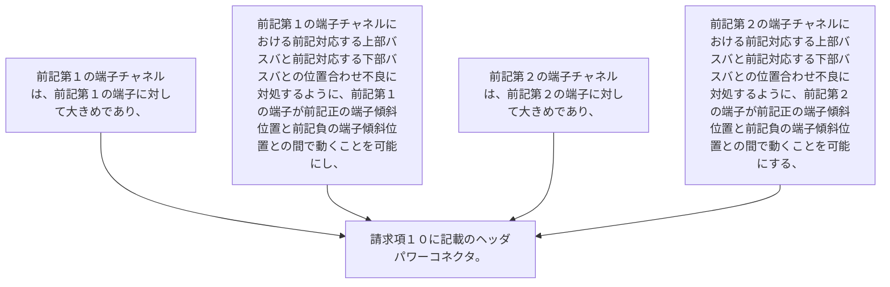

-  前記第１の端子チャネルは、前記第１の端子に対して大きめであり、
前記第１の端子チャネルにおける前記対応する上部バスバと前記対応する下部バスバとの位置合わせ不良に対処するように、前記第１の端子が前記正の端子傾斜位置と前記負の端子傾斜位置との間で動くことを可能にし、
-  前記第２の端子チャネルは、前記第２の端子に対して大きめであり、
前記第２の端子チャネルにおける前記対応する上部バスバと前記対応する下部バスバとの位置合わせ不良に対処するように、前記第２の端子が前記正の端子傾斜位置と前記負の端子傾斜位置との間で動くことを可能にする、
請求項１０に記載のヘッダパワーコネクタ。
