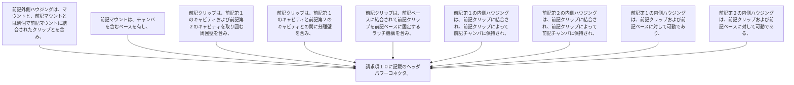

```mermaid
flowchart TD
A[前記外側ハウジングは、マウントと、前記マウントとは別個で前記マウントに結合されたクリップとを含み、]
B[前記マウントは、チャンバを含むベースを有し、]
C[前記クリップは、前記第１のキャビティおよび前記第２のキャビティを取り囲む周囲壁を含み、]
D[前記クリップは、前記第１のキャビティと前記第２のキャビティとの間に分離壁を含み、]
E[前記クリップは、前記ベースに結合されて前記クリップを前記ベースに固定するラッチ機構を含み、]
F[前記第１の内側ハウジングは、前記クリップに結合され、前記クリップによって前記チャンバに保持され、]
G[前記第２の内側ハウジングは、前記クリップに結合され、前記クリップによって前記チャンバに保持され、]
H[前記第１の内側ハウジングは、前記クリップおよび前記ベースに対して可動であり、]
I[前記第２の内側ハウジングは、前記クリップおよび前記ベースに対して可動である、]
J[請求項１０に記載のヘッダパワーコネクタ。]
A --> J
B --> J
C --> J
D --> J
E --> J
F --> J
G --> J
H --> J
I --> J
```