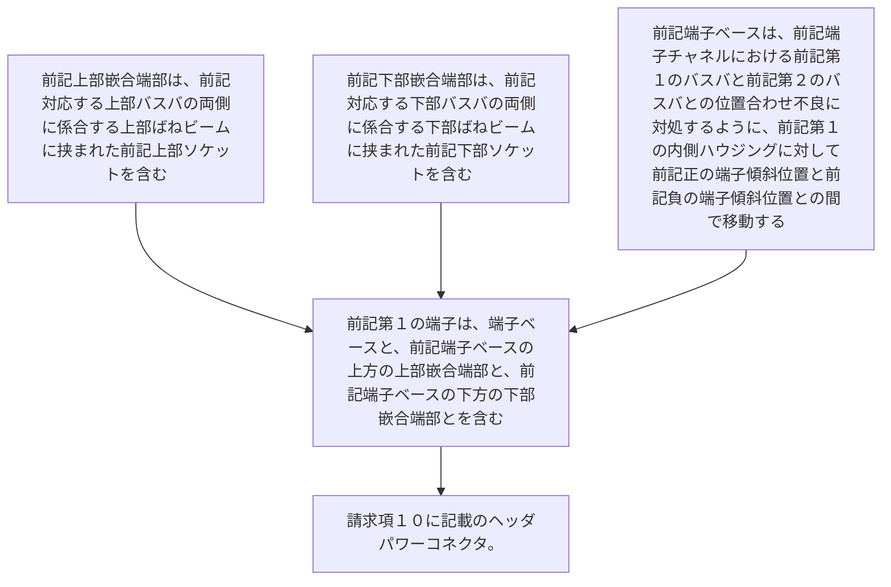

```mermaid
flowchart TD
N1[前記第１の端子は、端子ベースと、前記端子ベースの上方の上部嵌合端部と、前記端子ベースの下方の下部嵌合端部とを含む]
N2[前記上部嵌合端部は、前記対応する上部バスバの両側に係合する上部ばねビームに挟まれた前記上部ソケットを含む]
N3[前記下部嵌合端部は、前記対応する下部バスバの両側に係合する下部ばねビームに挟まれた前記下部ソケットを含む]
N4[前記端子ベースは、前記端子チャネルにおける前記第１のバスバと前記第２のバスバとの位置合わせ不良に対処するように、前記第１の内側ハウジングに対して前記正の端子傾斜位置と前記負の端子傾斜位置との間で移動する]
N5[請求項１０に記載のヘッダパワーコネクタ。]

N2 --> N1
N3 --> N1
N4 --> N1
N1 --> N5
```