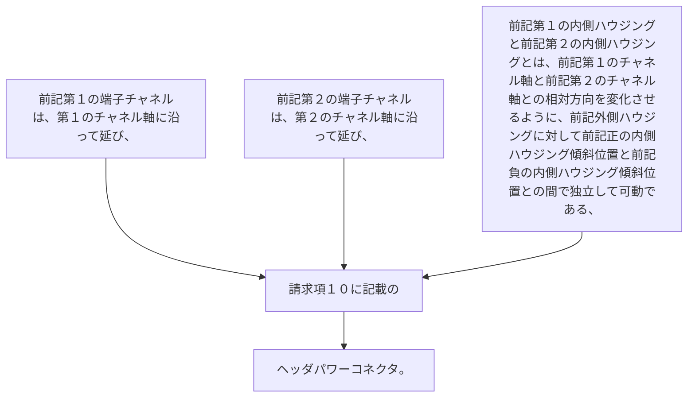

前記第１の端子チャネルは、第１のチャネル軸に沿って延び、
前記第２の端子チャネルは、第２のチャネル軸に沿って延び、
前記第１の内側ハウジングと前記第２の内側ハウジングとは、前記第１のチャネル軸と前記第２のチャネル軸との相対方向を変化させるように、前記外側ハウジングに対して前記正の内側ハウジング傾斜位置と前記負の内側ハウジング傾斜位置との間で独立して可動である、
請求項１０に記載のヘッダパワーコネクタ。
