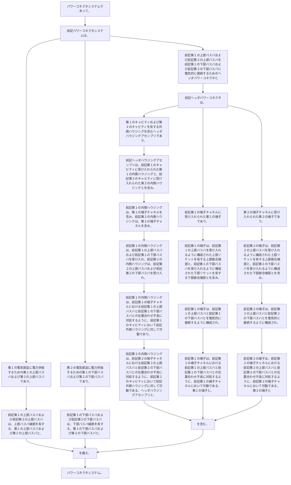

パワーコネクタシステムであって、
前記パワーコネクタシステムは、
●  第１の電気部品に電力供給するための第１の上部バスバおよび第２の上部バスバであり、
前記第１の上部バスバおよび前記第２の上部バスバは、上部バスバ縁部を有する、第１の上部バスバおよび第２の上部バスバと、
●  第２の電気部品に電力供給するための第１の下部バスバおよび第２の下部バスバであり、
前記第１の下部バスバおよび前記第２の下部バスバは、下部バスバ縁部を有する、第１の下部バスバおよび第２の下部バスバと、
●  前記第１の上部バスバおよび前記第２の上部バスバを前記第１の下部バスバおよび前記第２の下部バスバに電気的に接続するためのヘッダパワーコネクタと
を備え、
前記ヘッダパワーコネクタは、
-    第１のキャビティおよび第２のキャビティを有する外側ハウジングを含むヘッダハウジングアセンブリであり、
前記ヘッダハウジングアセンブリは、前記第１のキャビティに受け入れられた第１の内側ハウジングと、前記第２のキャビティに受け入れられた第２の内側ハウジングとを含み、前記第１の内側ハウジングは、第１の端子チャネルを含み、前記第２の内側ハウジングは、第２の端子チャネルを含み、
前記第１の内側ハウジングは、前記第１の上部バスバおよび前記第１の下部バスバを受け入れ、前記第２の内側ハウジングは、前記第２の上部バスバおよび前記第２の下部バスバを受け入れ、
前記第１の内側ハウジングは、前記第１の端子チャネルにおける前記第１の上部バスバと前記第１の下部バスバとの位置合わせ不良に対処するように、前記第１のキャビティにおいて前記外側ハウジングに対して可動であり、
前記第２の内側ハウジングは、前記第２の端子チャネルにおける前記第２の上部バスバと前記第２の下部バスバとの位置合わせ不良に対処するように、前記第２のキャビティにおいて前記外側ハウジングに対して可動である、ヘッダハウジングアセンブリと、
-    前記第１の端子チャネルに受け入れられた第１の端子であり、
前記第１の端子は、前記第１の上部バスバを受け入れるように構成された上部ソケットを有する上部嵌合端部と、前記第１の下部バスバを受け入れるように構成された下部ソケットを有する下部嵌合端部とを含み、
前記第１の端子は、前記第１の上部バスバと前記第１の下部バスバとを電気的に接続するように構成され、
前記第１の端子は、前記第１の端子チャネルにおける前記第１の上部バスバと前記第１の下部バスバとの位置合わせ不良に対処するように、前記第１の端子チャネルにおいて可動である、第１の端子と、
-    第２の端子チャネルに受け入れられた第２の端子であり、
前記第２の端子は、前記第２の上部バスバを受け入れるように構成された上部ソケットを有する上部嵌合端部と、前記第２の下部バスバを受け入れるように構成された下部ソケットを有する下部嵌合端部とを含み、
前記第２の端子は、前記第２の上部バスバと前記第２の下部バスバとを電気的に接続するように構成され、
前記第２の端子は、前記第２の端子チャネルにおける前記第２の上部バスバと前記第２の下部バスバとの位置合わせ不良に対処するように、前記第２の端子チャネルにおいて可動である、第２の端子と
を含む、
パワーコネクタシステム。
