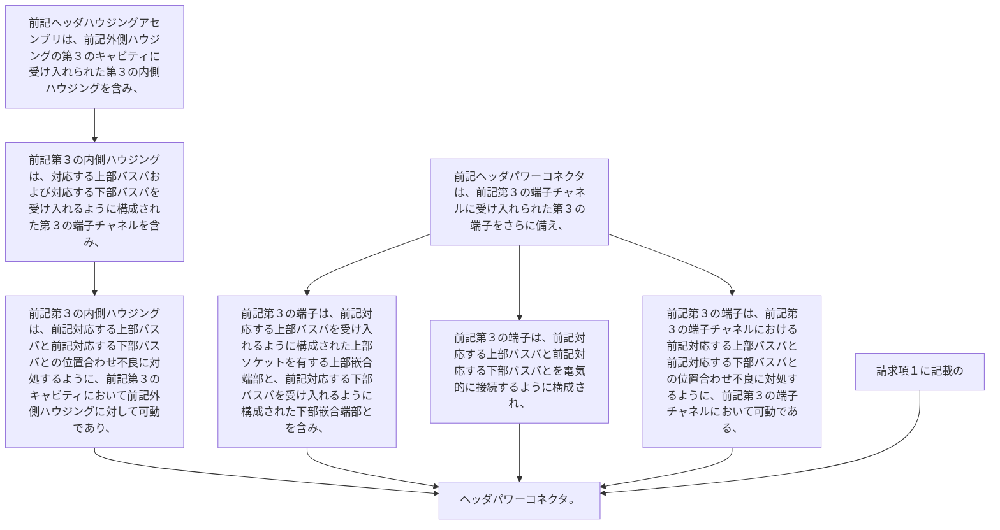

-  前記ヘッダハウジングアセンブリは、前記外側ハウジングの第３のキャビティに受け入れられた第３の内側ハウジングを含み、前記第３の内側ハウジングは、対応する上部バスバおよび対応する下部バスバを受け入れるように構成された第３の端子チャネルを含み、前記第３の内側ハウジングは、前記対応する上部バスバと前記対応する下部バスバとの位置合わせ不良に対処するように、前記第３のキャビティにおいて前記外側ハウジングに対して可動であり、
-  前記ヘッダパワーコネクタは、前記第３の端子チャネルに受け入れられた第３の端子をさらに備え、前記第３の端子は、前記対応する上部バスバを受け入れるように構成された上部ソケットを有する上部嵌合端部と、前記対応する下部バスバを受け入れるように構成された下部ソケットを有する下部嵌合端部とを含み、前記第３の端子は、前記対応する上部バスバと前記対応する下部バスバとを電気的に接続するように構成され、前記第３の端子は、前記第３の端子チャネルにおける前記対応する上部バスバと前記対応する下部バスバとの位置合わせ不良に対処するように、前記第３の端子チャネルにおいて可動である、
請求項１に記載のヘッダパワーコネクタ。
