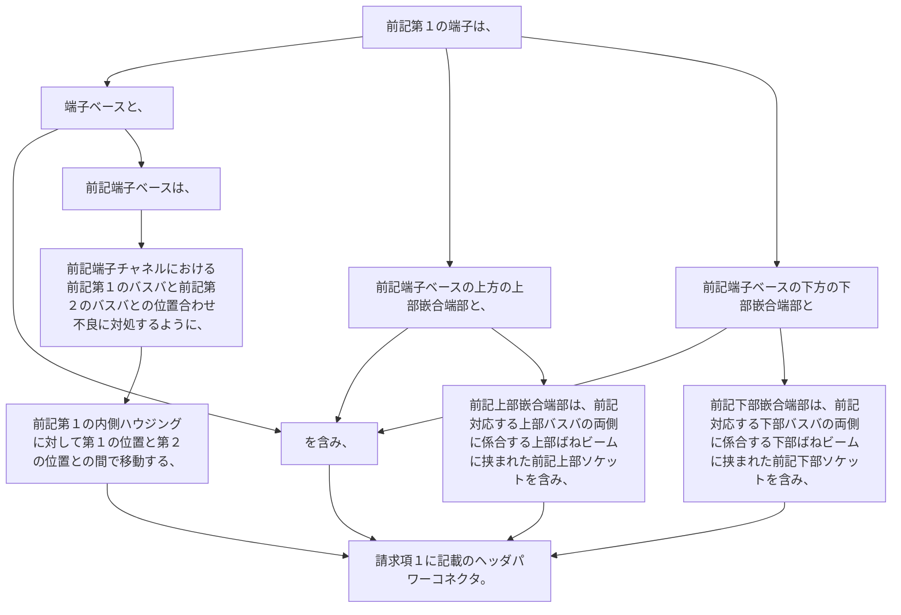

-  前記第１の端子は、端子ベースと、前記端子ベースの上方の上部嵌合端部と、前記端子ベースの下方の下部嵌合端部とを含み、前記上部嵌合端部は、前記対応する上部バスバの両側に係合する上部ばねビームに挟まれた前記上部ソケットを含み、前記下部嵌合端部は、前記対応する下部バスバの両側に係合する下部ばねビームに挟まれた前記下部ソケットを含み、
-  前記端子ベースは、前記端子チャネルにおける前記第１のバスバと前記第２のバスバとの位置合わせ不良に対処するように、前記第１の内側ハウジングに対して第１の位置と第２の位置との間で移動する、
請求項１に記載のヘッダパワーコネクタ。
