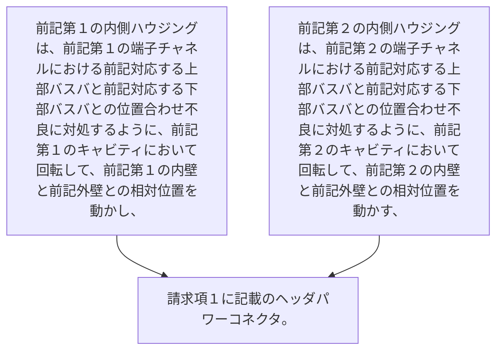

-  前記第１の内側ハウジングは、前記第１の端子チャネルにおける前記対応する上部バスバと前記対応する下部バスバとの位置合わせ不良に対処するように、前記第１のキャビティにおいて回転して、前記第１の内壁と前記外壁との相対位置を動かし、
-  前記第２の内側ハウジングは、前記第２の端子チャネルにおける前記対応する上部バスバと前記対応する下部バスバとの位置合わせ不良に対処するように、前記第２のキャビティにおいて回転して、前記第２の内壁と前記外壁との相対位置を動かす、
請求項１に記載のヘッダパワーコネクタ。
