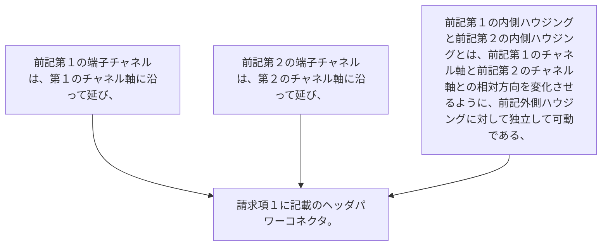

前記第１の端子チャネルは、第１のチャネル軸に沿って延び、
前記第２の端子チャネルは、第２のチャネル軸に沿って延び、
前記第１の内側ハウジングと前記第２の内側ハウジングとは、前記第１のチャネル軸と前記第２のチャネル軸との相対方向を変化させるように、前記外側ハウジングに対して独立して可動である、
請求項１に記載のヘッダパワーコネクタ。

```mermaid
flowchart TD
A[前記第１の端子チャネルは、第１のチャネル軸に沿って延び、]
B[前記第２の端子チャネルは、第２のチャネル軸に沿って延び、]
C[前記第１の内側ハウジングと前記第２の内側ハウジングとは、前記第１のチャネル軸と前記第２のチャネル軸との相対方向を変化させるように、前記外側ハウジングに対して独立して可動である、]
D[請求項１に記載のヘッダパワーコネクタ。]
A --> D
B --> D
C --> D
```