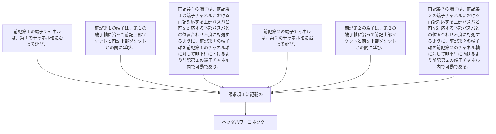

-  前記第１の端子チャネルは、第１のチャネル軸に沿って延び、
前記第１の端子は、第１の端子軸に沿って前記上部ソケットと前記下部ソケットとの間に延び、
前記第１の端子は、前記第１の端子チャネルにおける前記対応する上部バスバと前記対応する下部バスバとの位置合わせ不良に対処するように、前記第１の端子軸を前記第１のチャネル軸に対して非平行に向けるよう前記第１の端子チャネル内で可動であり、
-  前記第２の端子チャネルは、第２のチャネル軸に沿って延び、
前記第２の端子は、第２の端子軸に沿って前記上部ソケットと前記下部ソケットとの間に延び、
前記第２の端子は、前記第２の端子チャネルにおける前記対応する上部バスバと前記対応する下部バスバとの位置合わせ不良に対処するように、前記第２の端子軸を前記第２のチャネル軸に対して非平行に向けるよう前記第２の端子チャネル内で可動である、
請求項１に記載のヘッダパワーコネクタ。
