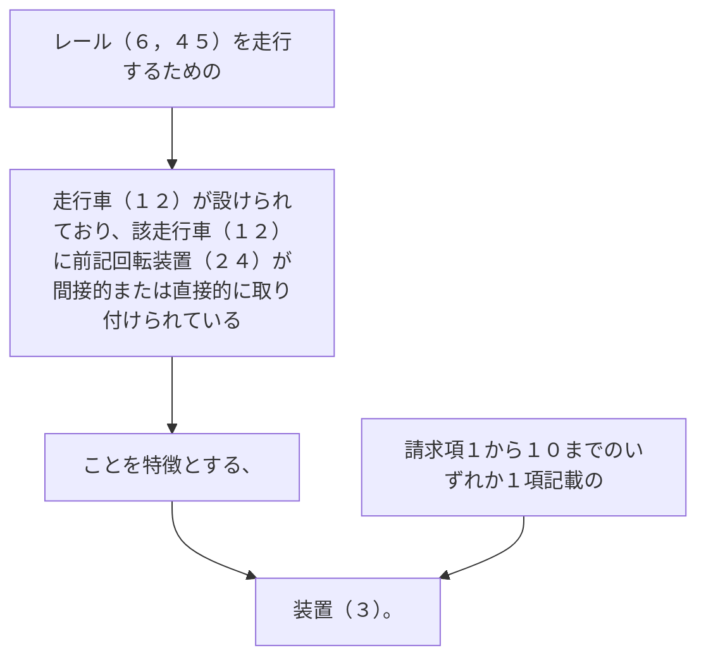

レール（６，４５）を走行するための走行車（１２）が設けられており、該走行車（１２）に前記回転装置（２４）が間接的または直接的に取り付けられていることを特徴とする、請求項１から１０までのいずれか１項記載の装置（３）。

```mermaid
flowchart TD
A[レール（６，４５）を走行するための]
B[走行車（１２）が設けられており、該走行車（１２）に前記回転装置（２４）が間接的または直接的に取り付けられている]
C[ことを特徴とする、]
D[請求項１から１０までのいずれか１項記載の]
E[装置（３）。]
A --> B
B --> C
C --> E
D --> E
```