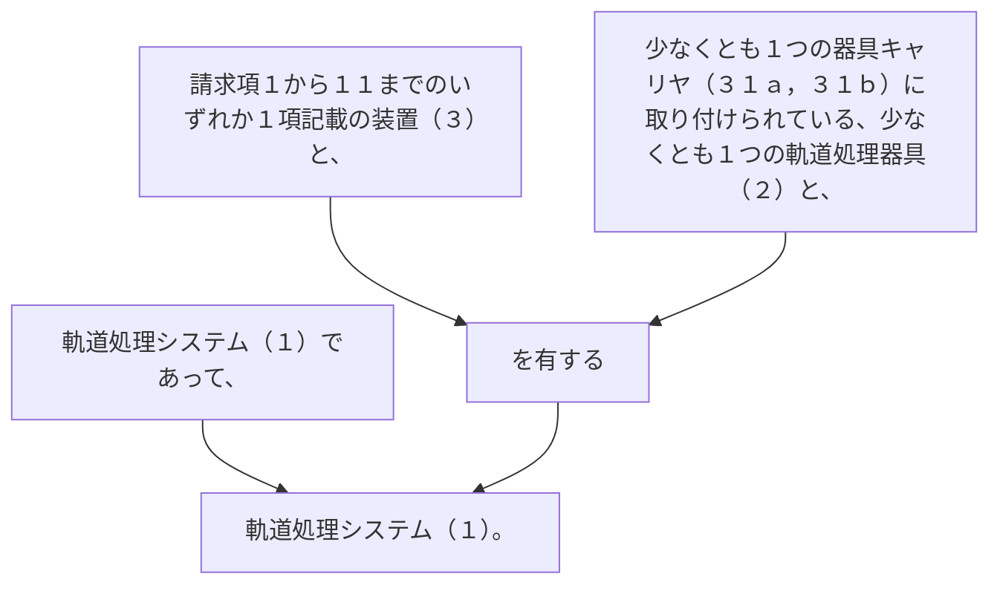

軌道処理システム（１）であって、
１２．１．請求項１から１１までのいずれか１項記載の装置（３）と、
１２．２．少なくとも１つの器具キャリヤ（３１ａ，３１ｂ）に取り付けられている、少なくとも１つの軌道処理器具（２）と、
を有する、軌道処理システム（１）。

```mermaid
flowchart TD
A[軌道処理システム（１）であって、]
B[請求項１から１１までのいずれか１項記載の装置（３）と、]
C[少なくとも１つの器具キャリヤ（３１ａ，３１ｂ）に取り付けられている、少なくとも１つの軌道処理器具（２）と、]
D[を有する]
E[軌道処理システム（１）。]
A --> E
B --> D
C --> D
D --> E
```