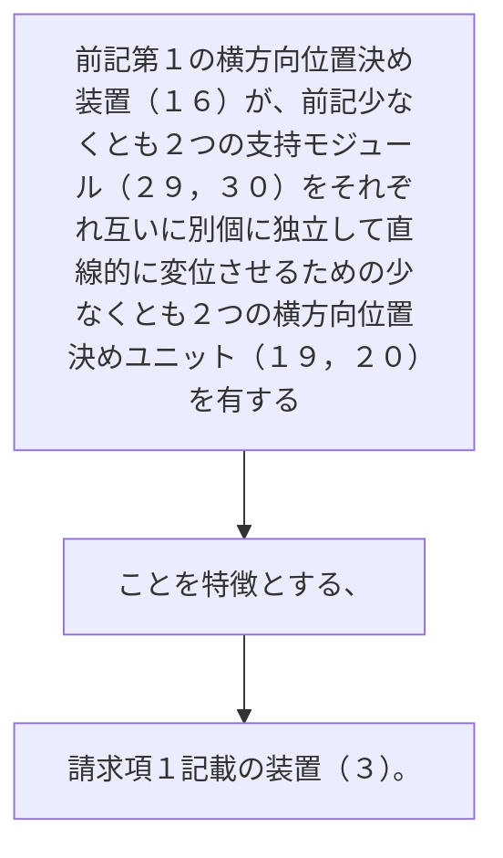

前記第１の横方向位置決め装置（１６）が、前記少なくとも２つの支持モジュール（２９，３０）をそれぞれ互いに別個に独立して直線的に変位させるための少なくとも２つの横方向位置決めユニット（１９，２０）を有することを特徴とする、請求項１記載の装置（３）。

```mermaid
flowchart TD
A[前記第１の横方向位置決め装置（１６）が、前記少なくとも２つの支持モジュール（２９，３０）をそれぞれ互いに別個に独立して直線的に変位させるための少なくとも２つの横方向位置決めユニット（１９，２０）を有する]
B[ことを特徴とする、]
C[請求項１記載の装置（３）。]
A --> B
B --> C
```