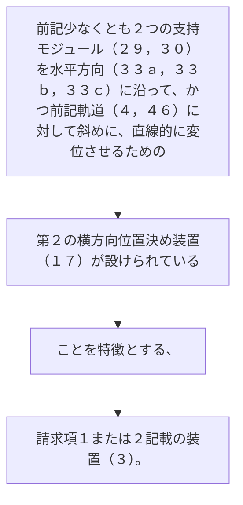

前記少なくとも２つの支持モジュール（２９，３０）を水平方向（３３ａ，３３ｂ，３３ｃ）に沿って、かつ前記軌道（４，４６）に対して斜めに、直線的に変位させるための第２の横方向位置決め装置（１７）が設けられていることを特徴とする、請求項１または２記載の装置（３）。

```mermaid
flowchart TD
A[前記少なくとも２つの支持モジュール（２９，３０）を水平方向（３３ａ，３３ｂ，３３ｃ）に沿って、かつ前記軌道（４，４６）に対して斜めに、直線的に変位させるための]
B[第２の横方向位置決め装置（１７）が設けられている]
C[ことを特徴とする、]
D[請求項１または２記載の装置（３）。]
A --> B
B --> C
C --> D
```