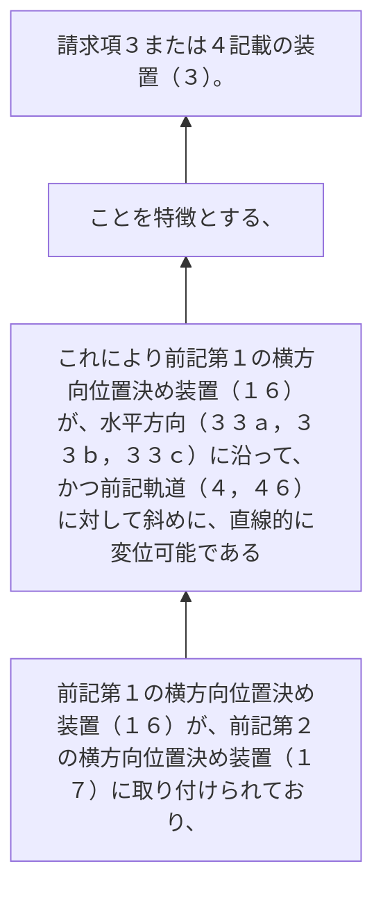

```mermaid
flowchart BT
A[前記第１の横方向位置決め装置（１６）が、前記第２の横方向位置決め装置（１７）に取り付けられており、]
B[これにより前記第１の横方向位置決め装置（１６）が、水平方向（３３ａ，３３ｂ，３３ｃ）に沿って、かつ前記軌道（４，４６）に対して斜めに、直線的に変位可能である]
C[ことを特徴とする、]
D[請求項３または４記載の装置（３）。]
A --> B
B --> C
C --> D
```