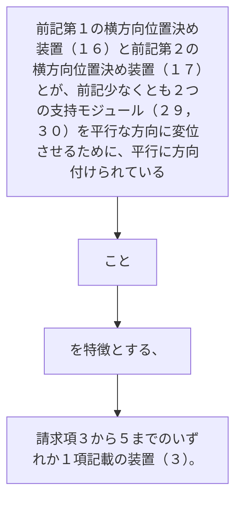

前記第１の横方向位置決め装置（１６）と前記第２の横方向位置決め装置（１７）とが、前記少なくとも２つの支持モジュール（２９，３０）を平行な方向に変位させるために、平行に方向付けられていることを特徴とする、請求項３から５までのいずれか１項記載の装置（３）。

```mermaid
flowchart TD
A[前記第１の横方向位置決め装置（１６）と前記第２の横方向位置決め装置（１７）とが、前記少なくとも２つの支持モジュール（２９，３０）を平行な方向に変位させるために、平行に方向付けられている]
B[こと]
C[を特徴とする、]
D[請求項３から５までのいずれか１項記載の装置（３）。]
A --> B
B --> C
C --> D
```