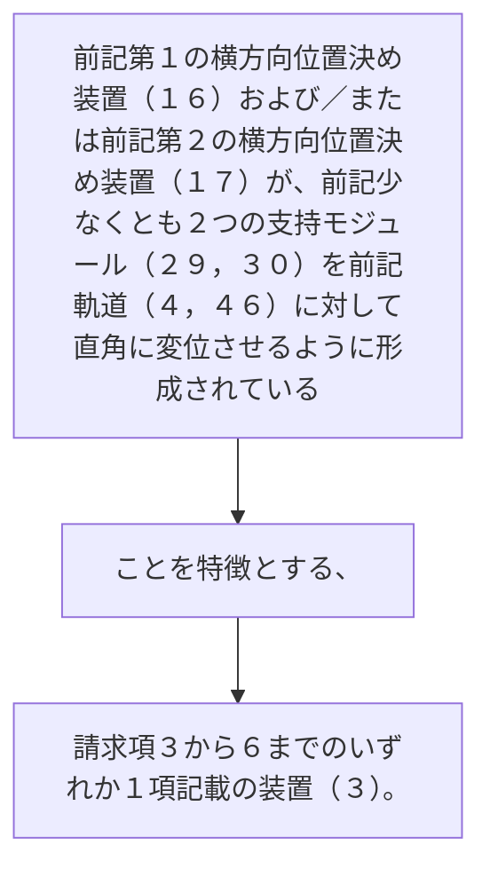

前記第１の横方向位置決め装置（１６）および／または前記第２の横方向位置決め装置（１７）が、前記少なくとも２つの支持モジュール（２９，３０）を前記軌道（４，４６）に対して直角に変位させるように形成されていることを特徴とする、請求項３から６までのいずれか１項記載の装置（３）。

```mermaid
flowchart TD
A[前記第１の横方向位置決め装置（１６）および／または前記第２の横方向位置決め装置（１７）が、前記少なくとも２つの支持モジュール（２９，３０）を前記軌道（４，４６）に対して直角に変位させるように形成されている]
B[ことを特徴とする、]
C[請求項３から６までのいずれか１項記載の装置（３）。]
A --> B
B --> C
```