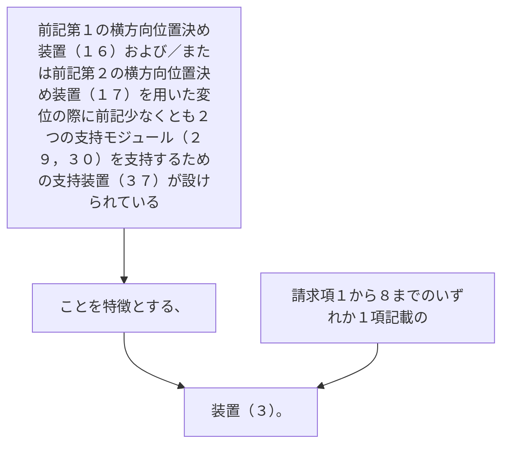

```mermaid
flowchart TD
A[前記第１の横方向位置決め装置（１６）および／または前記第２の横方向位置決め装置（１７）を用いた変位の際に前記少なくとも２つの支持モジュール（２９，３０）を支持するための支持装置（３７）が設けられている]
B[ことを特徴とする、]
C[請求項１から８までのいずれか１項記載の]
D[装置（３）。]
A --> B
B --> D
C --> D
```