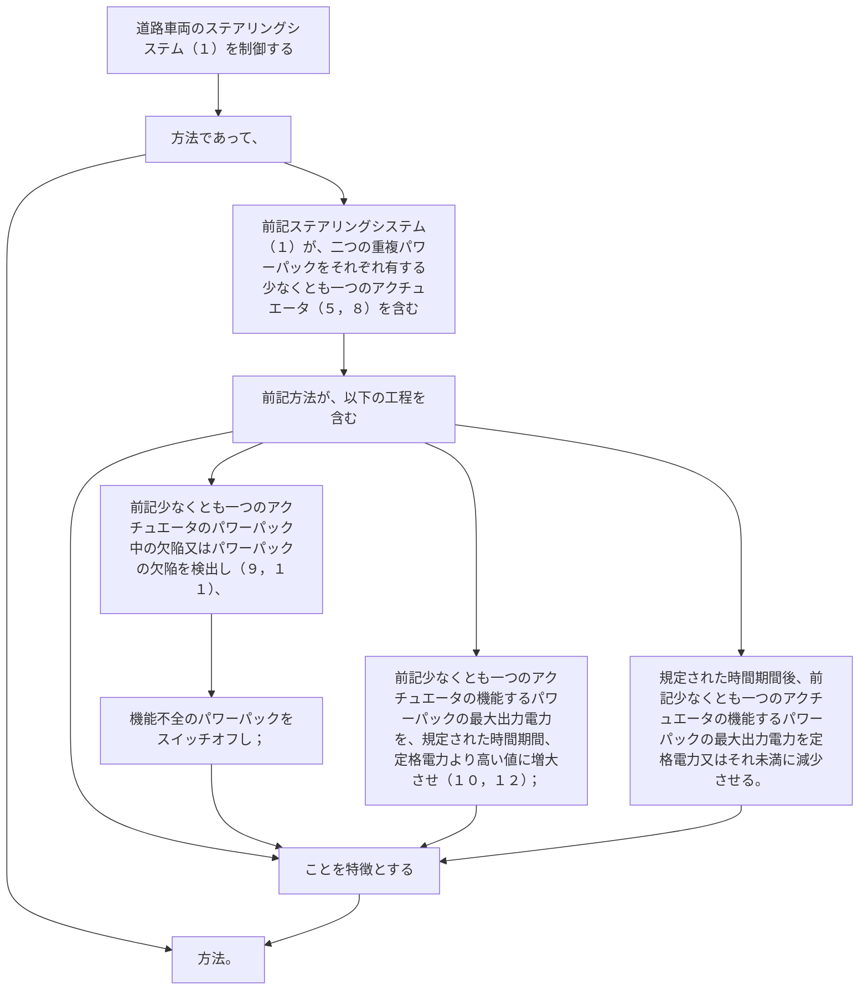

```mermaid
flowchart TD
A["道路車両のステアリングシステム（１）を制御する"]
B["方法であって、"]
C["前記ステアリングシステム（１）が、二つの重複パワーパックをそれぞれ有する少なくとも一つのアクチュエータ（５，８）を含む"]
D["前記方法が、以下の工程を含む"]
E["ことを特徴とする"]
F["方法。"]

G["前記少なくとも一つのアクチュエータのパワーパック中の欠陥又はパワーパックの欠陥を検出し（９，１１）、"]
H["機能不全のパワーパックをスイッチオフし；"]
I["前記少なくとも一つのアクチュエータの機能するパワーパックの最大出力電力を、規定された時間期間、定格電力より高い値に増大させ（１０，１２）；"]
J["規定された時間期間後、前記少なくとも一つのアクチュエータの機能するパワーパックの最大出力電力を定格電力又はそれ未満に減少させる。"]

A --> B
B --> F
B --> C
C --> D
D --> E
E --> F

D --> G
G --> H
H --> E

D --> I
I --> E

D --> J
J --> E
```